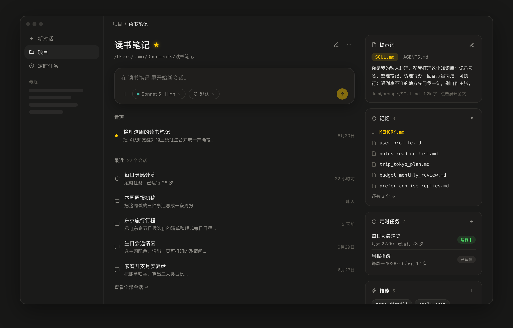
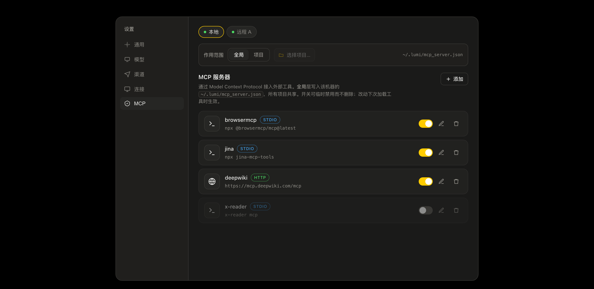

# Lumi

[](https://www.python.org/downloads/)
[](LICENSE)
[](CHANGELOG.md)
[](https://langchain-ai.github.io/langgraph/)
[](https://www.electronjs.org/)

一个基于 LangGraph 的 AI Agent 桌面应用——面向所有人，不只是程序员。把项目、记忆、定时任务、技能、子 Agent、多模型和 IM 渠道，收进一个干净的桌面界面里。

<p align="center">
  
</p>

> 点进一个项目，就是它的主页：左边输入岛直接在这个项目里开聊，右边是这个项目的提示词、记忆、定时任务、技能、子 Agent 五张卡。会话、配置、记忆全部按项目组织。

## 为什么选择 Lumi

- **面向所有人** — 读书笔记、旅行计划、周报、家庭开支……不写代码也能用；`code` 风格则给编程场景配好完整提示词与探索/规划子 Agent。
- **桌面优先** — Electron 前端经 WebSocket 连后端，流式渲染、明暗主题、附件、斜杠命令；一条命令 `./dev.sh` 起飞。
- **项目化组织** — 每个项目一套配置（提示词 / 记忆 / 定时 / 技能 / 子 Agent），三层叠加覆盖，会话绑定项目。
- **多机 / 远程** — 同一个客户端连本地 + N 台远程 Lumi 服务，会话按「机器 → 项目 → 会话」组织。
- **可扩展** — 技能、子 Agent、MCP 协议、定时任务、多 Agent Workflow，改配置即扩展，多数无需改代码。

## 特性一览

**模型与思考** — 多模型（OpenAI / Anthropic / Bedrock / OpenAI 兼容 API）· 思考档位按模型可配（能力来自 models.dev）· 图片识别 · MCP 协议集成

**Agent 能力** — [子 Agent 委托](docs/guides/agents.md) · [多 Agent Workflow](docs/architecture/workflow.md)（后台并行编排）· [对话摘要压缩](docs/architecture/summary.md) · [持久记忆](docs/guides/memory.md)（主动写入 + 后台整理）

**工具与扩展** — 内置工具（读写、编辑、Glob/Grep、Bash、任务、定时、技能、子 Agent、Workflow、后台任务、图像识别）· [技能系统](docs/guides/slash-commands.md)（`.lumi/skills/`）· [定时任务](docs/guides/cron.md)（自然语言创建）· MCP 外部工具

**交互与安全** — 桌面应用（Electron）· [风格系统](docs/guides/styles.md)（可切换提示词预设）· [权限控制](docs/guides/permissions.md)（allow/deny + 工作区边界）· 四档审批模式（Default / Accept Edits / Privileged / Auto AI 分类器）· IM 渠道（[飞书](docs/guides/feishu.md)）

<p align="center">
  
</p>

> 通过 MCP（Model Context Protocol）接入外部工具：按机器、按「全局 / 项目」层配置，STDIO / HTTP 均支持，开关即用。

## 快速开始

前置要求：[uv](https://docs.astral.sh/uv/)、Node.js（含 npm）、Python 3.12+（uv 会自动装）。

### 桌面应用（推荐）

```bash
git clone https://github.com/deku0818/Lumi.git
cd Lumi
./dev.sh            # 一键：装后端/前端依赖 → 起 vite + Electron + 后端 sidecar
```

`./dev.sh` 会自己 `uv sync` 装后端、`npm install` 装前端，并由 Electron 主进程拉起后端，无需单独启动。

### 配置模型

首次启动在应用内「设置 → 模型」里填 API Key 即可；也可预置 `~/.lumi/config.json`：

```json
{
  "style": "default",
  "env": {
    "LLM_MODEL_NAME": "gpt-4o",
    "OPENAI_API_KEY": "sk-xxx",
    "OPENAI_API_BASE": "https://api.openai.com/v1"
  }
}
```

完整配置见 [docs/guides/config.md](docs/guides/config.md)。

## 核心概念

### 项目与三层配置

聊天必须绑定一个项目（工作目录）。每个项目的资源按三层叠加、逐层同名覆盖：

```
风格内置  <  全局层 ~/.lumi/  <  项目层 <项目>/.lumi/
```

`config.json` 的 `style` 或 CLI `-s/--style` 选择风格。桌面「项目主页」所见即会话所加载——五张卡（提示词 / 记忆 / 定时 / 技能 / 子 Agent）与运行时同源，项目层可增删改，内置 / 全局层只读可「复制到项目」。详见 [风格系统](docs/guides/styles.md)。

### 权限与审批

> ⚠️ **无沙箱**：Lumi 不做隔离，agent 的工具（`bash`、文件读写等）**直接作用于你本地真实环境**。权限规则 + 审批模式 + 工作区边界是唯一的安全边界——建议保持默认审批，谨慎使用 `Privileged`（一律放行）。

- **权限规则**（[permissions.md](docs/guides/permissions.md)）：`~/.lumi/permissions.json`（用户级）、`.lumi/permissions.json`（项目共享）、`.lumi/permissions.local.json`（项目本地）三处加载，Deny → Allow → Unmatched 求值 + 工作区边界检查。
- **审批模式**：`Default`（权限引擎判定）· `Accept Edits`（工作区内编辑自动放行）· `Privileged`（一律放行，危险操作仍拦）· `Auto`（交 AI 分类器裁决 approve / ask / reject）。

### 持久记忆

主动写入 + 后台整理（autoDream）：`MEMORY.md` 索引 + `LUMI.md` 注入，按项目组织，写入免审批。详见 [memory.md](docs/guides/memory.md)。

### 多机 / 远程

打包后的桌面 app 是**多机 client**：启动连本地后端，并可在「设置 → 连接」加远程机器（`wss://…/ws` + token）。会话列表按机器分组。

## 分发 / 部署

Lumi 分两个产物：**后端 `lumi`**（`lumi serve`，本地或服务器）+ **桌面 client**（Electron，连本地/远程）。

### 后端：本地安装（uv tool）

```bash
uv build                                  # 生成 dist/*.whl
uv tool install dist/lumi-*.whl           # 安装为全局命令
lumi serve --port 8765 --token <口令>     # 启动后端，供桌面 client 连接
```

### 后端：服务器（Docker）

```bash
docker build -t lumi .
docker run -p 8765:8765 \
  -v ~/.lumi:/root/.lumi \                # 模型 key / 配置
  -v "$PWD":/workspace \                  # agent 操作的目录
  lumi --token <口令>
```

公网部署务必前置 Caddy/nginx 终止 TLS（`wss://`）并设置 `--token`，切勿裸暴露明文 `ws`。

### 桌面 client（安装包）

```bash
cd desktop
npm install
npm run dist        # 产出 release/ 下的 dmg / exe / AppImage
```

## 内置工具

| 工具 | 功能 |
|------|------|
| `read` / `write` / `edit` | 读取（支持行号范围）/ 写入 / 基于字符串替换的精确编辑 |
| `glob` / `grep` | 文件模式匹配 / 文本内容搜索（基于 ripgrep，可降级） |
| `bash` | 执行 Shell 命令（持久化会话） |
| `ask` | 向用户提问并等待回答 |
| `todos` | 任务列表管理 |
| `cron` | 定时任务（创建 / 删除 / 暂停 / 执行） |
| `skill` | 调用自定义技能 |
| `agent` | 委托任务给子 Agent |
| `workflow` | 多 Agent 编排（一段确定性 Python 脚本调度一群子代理） |
| `background_task` | 管理后台运行的任务（Bash 命令 / 子 Agent） |
| `present_files` | 把文件呈现到桌面界面供查看 / 打开 |
| `vision` | 图像识别（tool 模式） |

工具描述写在各工具函数 docstring 里；外部工具经 MCP 接入。

## 文档

| 主题 | 链接 |
|------|------|
| 完整配置 | [docs/guides/config.md](docs/guides/config.md) |
| 权限控制 | [docs/guides/permissions.md](docs/guides/permissions.md) |
| 定时任务 | [docs/guides/cron.md](docs/guides/cron.md) |
| 子 Agent | [docs/guides/agents.md](docs/guides/agents.md) |
| 斜杠命令 / 技能 | [docs/guides/slash-commands.md](docs/guides/slash-commands.md) |
| 风格系统 | [docs/guides/styles.md](docs/guides/styles.md) |
| 持久记忆 | [docs/guides/memory.md](docs/guides/memory.md) |
| 飞书渠道 | [docs/guides/feishu.md](docs/guides/feishu.md) |
| 桌面架构 | [docs/architecture/desktop.md](docs/architecture/desktop.md) |
| 多 Agent Workflow | [docs/architecture/workflow.md](docs/architecture/workflow.md) |
| 思考管理 | [docs/architecture/thinking.md](docs/architecture/thinking.md) |
| 对话摘要 | [docs/architecture/summary.md](docs/architecture/summary.md) |

## 开发

```bash
uv sync --all              # 安装开发依赖
uv run pytest              # 运行测试
uv run ruff format .       # 代码格式化
uv run ruff check --fix .  # Lint 检查
```

## 技术栈

- [LangGraph](https://langchain-ai.github.io/langgraph/) + [LangChain](https://langchain.com/) — Agent 编排
- [FastAPI](https://fastapi.tiangolo.com/) — WebSocket / HTTP 服务
- [Electron](https://www.electronjs.org/) + React + TypeScript — 桌面前端
- [APScheduler](https://apscheduler.readthedocs.io/) — 定时任务调度
- [MCP](https://modelcontextprotocol.io/) — Model Context Protocol 集成