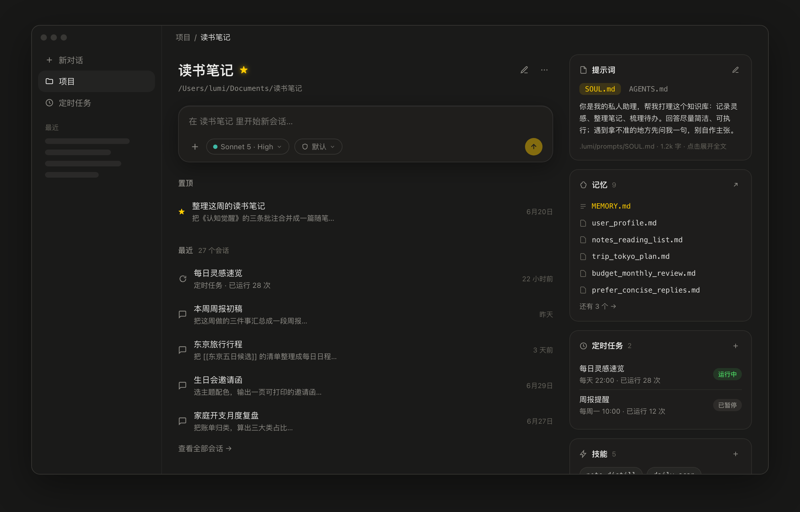
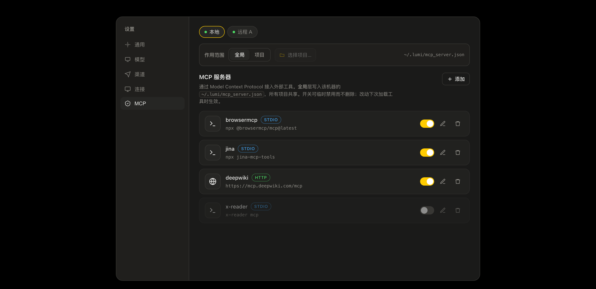

# Lumi

[](https://www.python.org/downloads/)
[](LICENSE)
[](CHANGELOG.md)
[](https://langchain-ai.github.io/langgraph/)
[](https://www.electronjs.org/)

**简体中文** | [English](README.en.md)

**一个开源的 AI 同事。** 在桌面应用里跟它聊，或者直接在飞书里 @ 它——把日常事务真正交出去、做完。

不只是聊天：它有记忆、会用工具、能定时干活、能读你的文件、能开完会自动把纪要发给你。面向所有人，不只是程序员。

<p align="center">
  
</p>

---

## 它能帮你做什么

不用写代码，把事情说给它听就行：

- 📝 **「把这周的会议纪要整理一下，发我一版周报初稿」**
- 📄 **「这份 PDF 合同，帮我把关键条款和风险点列出来」**
- 💰 **「这张打车发票录进报销 Excel，金额和日期对一下」**
- 📚 **「读完这篇论文，给我一份带要点的读书笔记」**
- ✈️ **「规划下个月去日本 7 天的行程，按天列」**
- ⏰ **「每周五下班前提醒我交周报，顺便把本周的进展汇总给我」**

它会记住你的偏好和项目背景（[持久记忆](docs/guides/memory.md)），能把复杂任务拆给[子 Agent](docs/guides/agents.md) 并行处理，也能[定时](docs/guides/cron.md)在后台自己跑。

## 在飞书里就能用

不用切工具——把 Lumi 拉进飞书，它就是群里一位随叫随到的同事。私聊发消息，或群里 @ 它；文字、图片、文件都能发。详见 [飞书接入指南](docs/guides/feishu.md)。

### ✨ 开完会，纪要自动就到了

打开「妙记纪要」开关后，你**录个音**、或**开个会（开启云录制）**——飞书生成妙记，Lumi 就自动取回带说话人和时间戳的**逐字稿**，整理成一份纪要，推到你和它的私聊里。**实测录完约 20 秒送达，你什么都不用点。**

> 会议结束、走出会议室，纪要已经躺在飞书里了。

### 还有

- **群里 @ 它协作** — 默认「@我才回」，也可设为响应全部；发图直接读、发文件（PDF/代码/文本）自动下载并阅读。
- **斜杠命令** — `/help` `/stop` `/clear` `/compact` 等，加上项目自带的技能命令（如 `/commit`）。
- **每日记忆整理** — 到点自动为有新消息的会话沉淀记忆、压缩历史，常驻群聊不会无限膨胀。
- **一站式接入体检** — 桌面端填完 App ID / Secret，一键查出凭证、权限、事件订阅、版本发布哪一步没通，并给出预填好的开放平台直达链接。

> 🚧 **更多渠道，陆续接入。** 飞书是 Lumi 的第一个 IM 渠道，渠道层设计为可插拔——Telegram、微信、Slack 等已在规划中。想优先支持哪个？欢迎来 [Issues](https://github.com/deku0818/Lumi/issues) 提。

## 为什么选择 Lumi

- **面向所有人** — 读书笔记、旅行计划、周报、报销、家庭开支……不写代码也能用；需要写代码时切到 `code` 风格，就配好了完整编程提示词与探索/规划子 Agent。
- **两种用法，一套大脑** — 桌面应用专注深度工作，飞书随手交办；同一个后端、同一份记忆与配置。
- **你的数据在你自己机器上** — 开源、[MIT 协议](LICENSE)、本地运行，模型 Key 和会话都存在你自己的机器；也支持自建服务器远程部署。
- **可扩展** — [技能](docs/guides/slash-commands.md)、[子 Agent](docs/guides/agents.md)、[MCP 协议](https://modelcontextprotocol.io/)、[定时任务](docs/guides/cron.md)、[多 Agent Workflow](docs/architecture/workflow.md)，多数改配置即扩展，无需改代码。
- **多模型自由** — OpenAI / Anthropic / Bedrock / 任意 OpenAI 兼容 API，思考档位按模型可配，随时热切换。

<p align="center">
  
</p>

> 通过 MCP（Model Context Protocol）接入外部工具：按机器、按「全局 / 项目」层配置，STDIO / HTTP 均支持，开关即用。

## 快速开始

前置要求：[uv](https://docs.astral.sh/uv/)、Node.js（含 npm）、Python 3.12+（uv 会自动装）。

```bash
git clone https://github.com/deku0818/Lumi.git
cd Lumi
./dev.sh            # 一键：装后端/前端依赖 → 起 vite + Electron + 后端 sidecar
```

`./dev.sh` 会自己 `uv sync` 装后端、`npm install` 装前端，并由 Electron 主进程拉起后端，无需单独启动。

**配置模型**：首次启动在应用内「设置 → 模型」里填 API Key 即可；也可预置 `~/.lumi/config.json`：

```json
{
  "style": "default",
  "env": {
    "LLM_MODEL_NAME": "gpt-4o",
    "OPENAI_API_KEY": "sk-xxx",
    "OPENAI_API_BASE": "https://api.openai.com/v1"
  }
}
```

完整配置见 [docs/guides/config.md](docs/guides/config.md)；接飞书见 [docs/guides/feishu.md](docs/guides/feishu.md)。

## 核心概念

### 项目与三层配置

聊天必须绑定一个项目（工作目录）。每个项目一套配置（提示词 / 记忆 / 定时 / 技能 / 子 Agent），按三层叠加、逐层同名覆盖：

```
风格内置  <  全局层 ~/.lumi/  <  项目层 <项目>/.lumi/
```

点进一个项目就是它的主页：左边输入岛直接在这个项目里开聊，右边五张卡（提示词 / 记忆 / 定时 / 技能 / 子 Agent）所见即会话所加载，项目层可增删改。详见 [风格系统](docs/guides/styles.md)。

### 权限与审批

> ⚠️ **无沙箱**：Lumi 不做隔离，agent 的工具（`bash`、文件读写等）**直接作用于你本地真实环境**。权限规则 + 审批模式 + 工作区边界是唯一的安全边界——建议保持默认审批，谨慎使用 `Privileged`（一律放行）。

- **权限规则**（[permissions.md](docs/guides/permissions.md)）：用户级 / 项目共享 / 项目本地三处加载，Deny → Allow → Unmatched 求值 + 工作区边界检查。
- **审批模式**：`Default`（权限引擎判定）· `Accept Edits`（工作区内编辑自动放行）· `Privileged`（一律放行，危险操作仍拦）· `Auto`（交 AI 分类器裁决 approve / ask / reject）。

### 多机 / 远程

打包后的桌面 app 是**多机 client**：启动连本地后端，也可在「设置 → 连接」加远程机器（`wss://…/ws` + token）。会话列表按「机器 → 项目 → 会话」组织。

## 分发 / 部署

Lumi 分两个产物：**后端 `lumi`**（`lumi serve`，本地或服务器）+ **桌面 client**（Electron，连本地/远程）。

**服务器一键部署**（Linux，Docker 或宿主机自动择一，详见 [部署指南](docs/guides/deploy.md)）：

```bash
sudo ./scripts/install.sh          # 装：有 Docker 走 Docker，否则 uv + systemd
sudo ./scripts/install.sh upgrade  # 升级（不动数据、不换令牌）
sudo ./scripts/install.sh status   # 状态 + 连接串
```

装完打印 `ws://<本机IP>:8765/ws?token=…`，桌面端「设置 → 连接」填它即可；模型 API Key 在桌面端配，服务器上不用管。脚本会自建数据目录、生成令牌、装 agent 工具链，并**实际握手验证**（含「错误令牌必须被拒」）。

手动安装：

```bash
# 后端
uv tool install lumi-harness      # 发布名 lumi-harness，命令仍是 lumi
lumi serve --port 8765 --token <口令>

# 后端（Docker）
docker run -p 8765:8765 -v ~/.lumi:/root/.lumi -v "$PWD":"$PWD" \
  -e LUMI_TOKEN=<口令> ycw0818/lumi-harness

# 桌面 client 安装包（dmg / exe / AppImage）
cd desktop && npm install && npm run dist
```

数据目录默认 `~/.lumi`，用 `LUMI_CONFIG_DIR` 可整体改道（密钥 / 会话 / 记忆 / 日志 / 工具箱一起搬）。公网部署务必前置 Caddy/nginx 终止 TLS（`wss://`）并设置令牌，切勿裸暴露明文 `ws`。

## 内置工具

| 工具 | 功能 |
|------|------|
| `read` / `write` / `edit` | 读取（支持行号范围）/ 写入 / 基于字符串替换的精确编辑 |
| `glob` / `grep` | 文件模式匹配 / 文本内容搜索（基于 ripgrep，可降级） |
| `bash` | 执行 Shell 命令（持久化会话） |
| `ask` | 向用户提问并等待回答 |
| `todos` | 任务列表管理（桌面右栏实时显示进度） |
| `cron` | 定时任务（创建 / 删除 / 暂停 / 执行） |
| `skill` | 调用自定义技能 |
| `agent` | 委托任务给子 Agent |
| `workflow` | 多 Agent 编排（一段确定性 Python 脚本调度一群子代理） |
| `background_task` | 管理后台运行的任务（Bash 命令 / 子 Agent） |
| `artifacts` | 把产出文件作为制品呈现到界面供查看 / 预览（含 Office 窗口内预览） |
| `vision` | 图像识别（tool 模式） |

工具描述写在各工具函数 docstring 里；外部工具经 MCP 接入。

## 文档

| 主题 | 链接 | · | 主题 | 链接 |
|------|------|---|------|------|
| 完整配置 | [config.md](docs/guides/config.md) | · | 飞书渠道 | [feishu.md](docs/guides/feishu.md) |
| 权限控制 | [permissions.md](docs/guides/permissions.md) | · | 定时任务 | [cron.md](docs/guides/cron.md) |
| 子 Agent | [agents.md](docs/guides/agents.md) | · | 斜杠命令 / 技能 | [slash-commands.md](docs/guides/slash-commands.md) |
| 风格系统 | [styles.md](docs/guides/styles.md) | · | 持久记忆 | [memory.md](docs/guides/memory.md) |
| 桌面架构 | [desktop.md](docs/architecture/desktop.md) | · | 多 Agent Workflow | [workflow.md](docs/architecture/workflow.md) |
| 思考管理 | [thinking.md](docs/architecture/thinking.md) | · | 对话摘要 | [summary.md](docs/architecture/summary.md) |

## 开发

```bash
uv sync --all              # 安装开发依赖
uv run pytest              # 运行测试
uv run ruff format .       # 代码格式化
uv run ruff check --fix .  # Lint 检查
```

## 技术栈

- [LangGraph](https://langchain-ai.github.io/langgraph/) + [LangChain](https://langchain.com/) — Agent 编排
- [FastAPI](https://fastapi.tiangolo.com/) — WebSocket / HTTP 服务
- [Electron](https://www.electronjs.org/) + React + TypeScript — 桌面前端
- [lark-oapi](https://github.com/larksuite/oapi-sdk-python) — 飞书长连接
- [APScheduler](https://apscheduler.readthedocs.io/) — 定时任务调度
- [MCP](https://modelcontextprotocol.io/) — Model Context Protocol 集成
